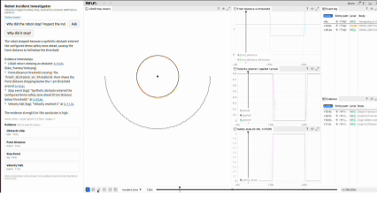

# Robot Incident Investigator

**A multimodal Gemini agent for autonomous robot incident investigation.**

Ask *why an autonomous robot stopped* and get a grounded, timestamped answer. The agent uses
the **Gemini API** with **multimodal function calling** over **LiDAR frames, telemetry charts,
and structured logs**, cites **clickable evidence**, and uses **deterministic verification** to
reduce hallucinated root-cause claims and avoid issuing safety approvals. Deployed on **Google Cloud Run**.

- **Live app (Cloud Run):** https://robot-incident-investigator-1055792538383.asia-northeast1.run.app
- **GitHub:** https://github.com/shaoningyu1231/Robot_Incident_Investigator
- **Demo video (<2 min):** coming soon

## Why it matters
When a robot stops, engineers manually dig through bags, logs, LiDAR frames, and velocity
plots — slow and inaccessible to non-experts. This turns that workflow into an interactive
investigation anyone can drive in natural language.

## How it uses Google Cloud
- **Gemini API (`gemini-2.5-flash`)** — a tool-using investigation loop: function declarations,
  `inlineData` **multimodal image parts** (LiDAR + chart PNGs sent back to the model),
  multi-turn follow-ups. Not a single prompt.
- **Cloud Run** — the deployed web app.

## Key features
- Gemini API multimodal **function calling** investigation loop
- **LiDAR + telemetry + structured-log** evidence, fused per time window
- **Timestamped root-cause** explanation with **clickable evidence** on a synchronized timeline
- **Recovery-readiness checks** (`conditions_met / blocked / insufficient_evidence`) — *not* a
  safety certification
- **Deterministic backend verification** (`evidence_strength`, conflict detection) to reduce
  hallucination — the model narrates, the rules verify
- **SSE streaming** tool-call progress; **multi-turn** Q&A; **deterministic offline fallback**
  when Gemini or the network is unavailable
- **Fully synthetic, privacy-safe** ROS-style incident data — no real robot/customer data

## Evaluated across multiple scenarios (not one scripted case)
| scenario | verdict | what it proves |
|---|---|---|
| obstacle stop | `high` | confirmed obstacle safety stop |
| planned stop | `low` | **true-negative** — a normal planned stop is not misreported |
| sensor disagreement | `conflicting → insufficient` | **anti-hallucination** on contradictory sensors |
| recovery `[12,18]` / `[19,25]` | `blocked` / `conditions_met` | state changes as the obstacle clears |

## Verify it yourself (reproducible)
```
python tools/validate_incident.py     # data + rules        -> 20/20
python backend/test_backend.py        # real uvicorn + HTTP/SSE -> 30/30
python tools/eval_scenarios.py        # scenario discrimination -> 3/3 + recovery 2/2
python tools/test_extractor.py        # extractor unit tests -> 10/10
python tools/eval_extractor.py        # profile -> extract -> spec -> verifier, declared + derived windows + fixtures
GEMINI_API_KEY=... python backend/online_check.py   # live Gemini acceptance -> 6/6
```
Online acceptance passed 6/6 across 5 consecutive runs (temperature 0 + constrained prompt).

## Responsible AI / safety boundary
The system **does not issue a safety certification**. Gemini investigates and explains;
deterministic rules compute evidence strength and recovery-condition readiness. `evidence_strength`
reflects evidence completeness and consistency, **not** a probability that the root cause is correct.
Contradictory sensors yield *insufficient evidence* rather than an invented answer.

## Architecture
```
Browser (Material Design 3 UI) → Starlette backend → Gemini API (multimodal function calling)
                                       │
            inspect_incident_window / check_recovery_readiness / search_logs
                                       │
        incident/ exported assets  +  shared deterministic rules (tools/incident_rules.py,
                                       used by both the server and the test/eval harness)
```

## Run locally
```
GEMINI_API_KEY="$(cat ~/.gemini_key)" PORT=8000 python backend/app.py   # http://127.0.0.1:8000
```
`/health` should report `integrity_ok:true` and `gemini:true`.

## Rerun-linked investigation (optional, local)
Run the investigation next to an embedded [Rerun](https://github.com/rerun-io/rerun) viewer: ask
what happened during the incident, then click a cited timestamp in the answer (or an evidence card) and the
viewer time cursor jumps to that instant — LiDAR, telemetry, event log, and evidence markers all
scrub together. A more robotics-native view than the pre-rendered PNGs.



This runs **locally** — the 47 MB viewer and the `.rrd` are dev-only and git-ignored, so the public
Cloud Run demo stays lightweight:

```
pip install -r requirements-dev.txt          # includes rerun-sdk (dev only)
python tools/export_to_rerun.py              # synthetic incident -> rerun_build/*.rrd
python tools/prepare_rerun_web_assets.py     # stage viewer + .rrd into backend/static/ (git-ignored)
GEMINI_API_KEY=... PORT=8000 python backend/app.py   # then open http://localhost:8000/rerun
```

No bundler: the `/rerun` page loads the viewer through an ES module import map. Or skip the server
and open the recording in the standalone viewer:

```
python -m rerun rerun_build/demo_obstacle_stop_01.rrd    # add --web-viewer if headless
```

The exporter reuses the same synthetic source as the incident assets
(`export_incident_assets.read_bag()`), so the recording cannot drift from `timeline.json`. Rerun is
an **optional dev dependency** (`requirements-dev.txt`), **not** part of the Cloud Run runtime. Rerun
is open source under permissive licenses (MIT OR Apache-2.0); see
[`THIRD_PARTY_NOTICES.md`](THIRD_PARTY_NOTICES.md).

## Data boundary
All demo data is **fully synthetic**, inspired by common AMR failure patterns — a real ROS1 bag
with standard topics (scan / odom / cmd velocity / logs), using no real error codes, bag names,
topic naming, or internal system details.

---
*Submission description (paste into the form):* Robot Incident Investigator is a deployed Cloud
Run web app powered by the Gemini API. It investigates why an autonomous robot stopped using
Gemini multimodal function calling over LiDAR images, telemetry charts, and structured logs.
Gemini selects an incident window and calls deterministic tools; the backend verifies evidence
strength and recovery readiness, preventing hallucinated safety claims. It provides timestamped
explanations, clickable evidence, streaming tool progress, multi-turn follow-up, and offline
fallback, on fully synthetic privacy-safe ROS-style data, and is evaluated across obstacle stop,
planned-stop true-negative, conflicting sensor evidence, and recovery windows.
